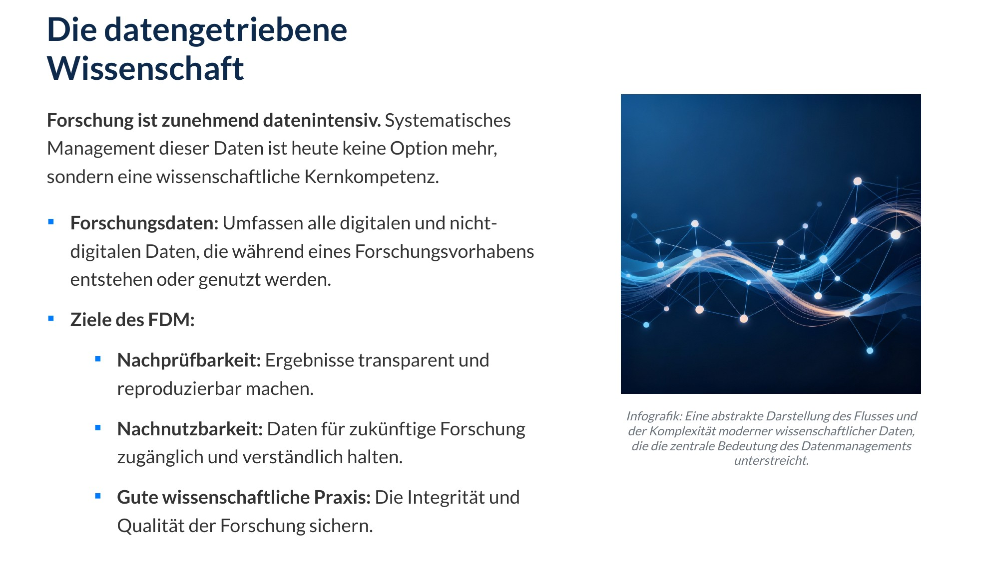
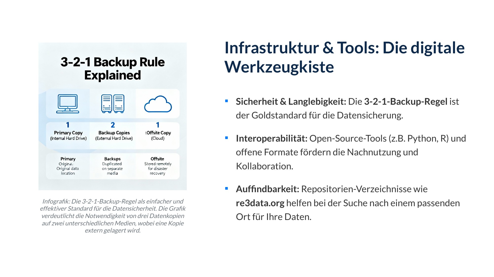
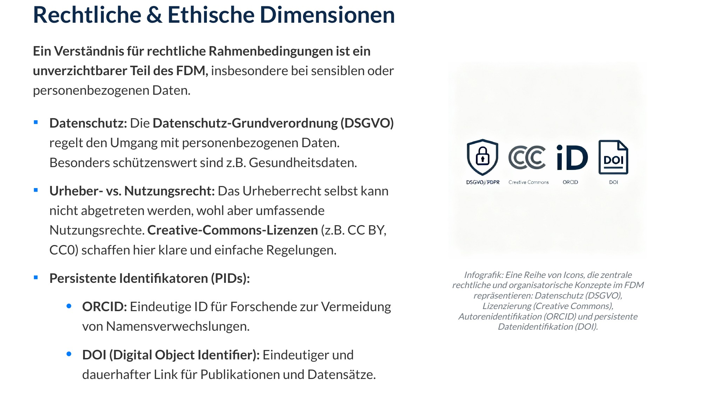
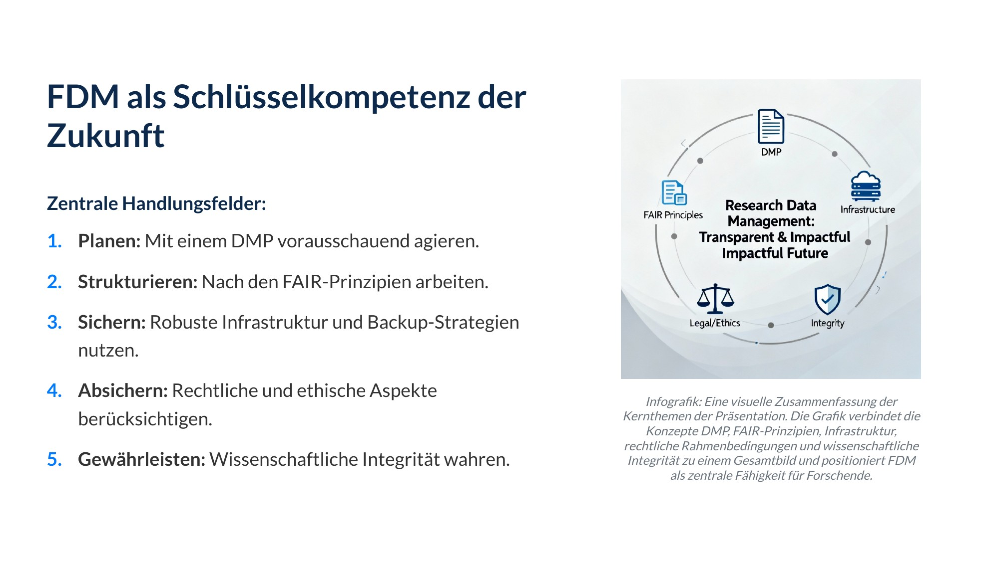
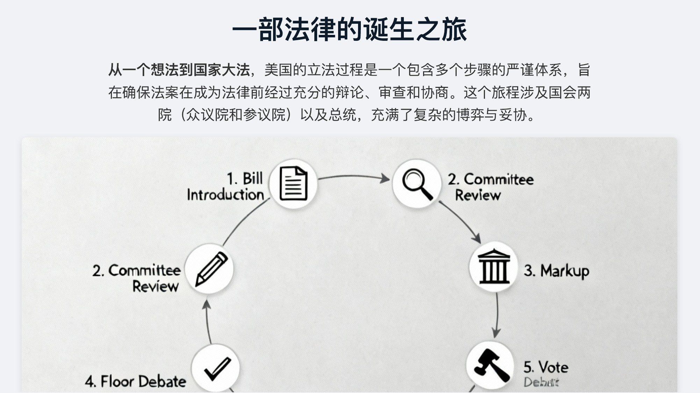
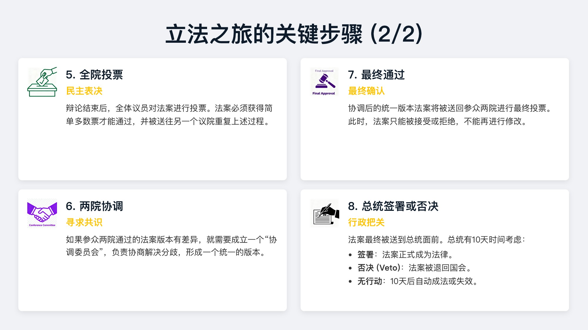
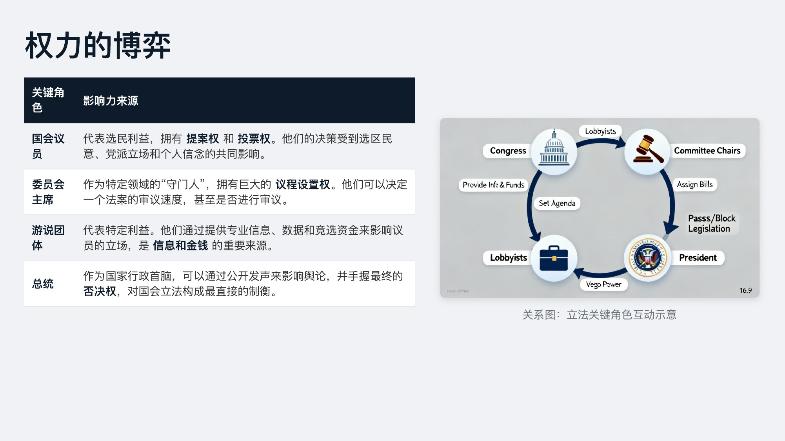
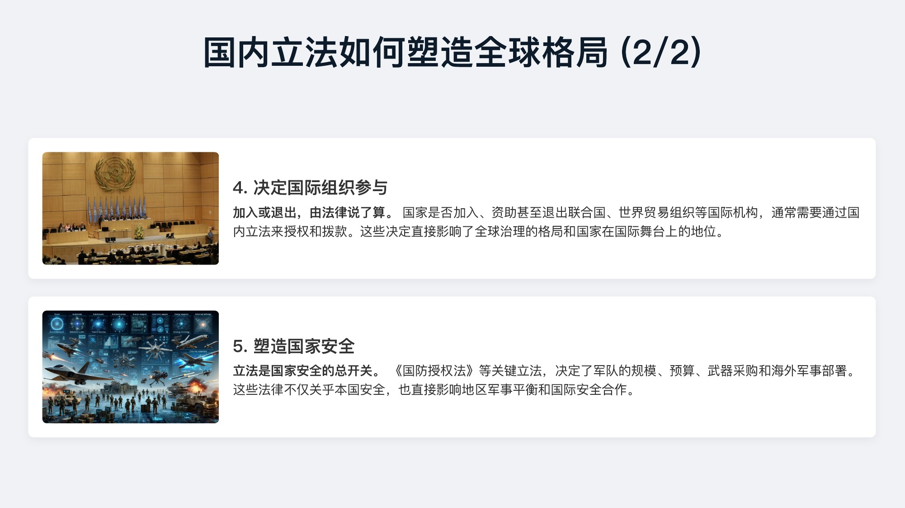
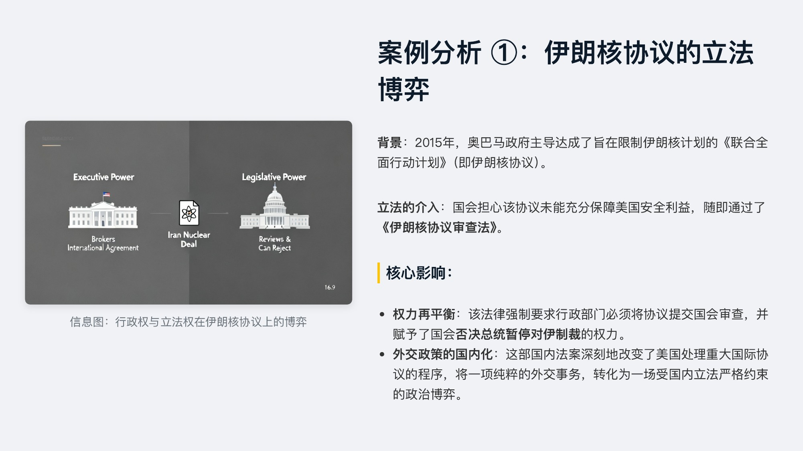
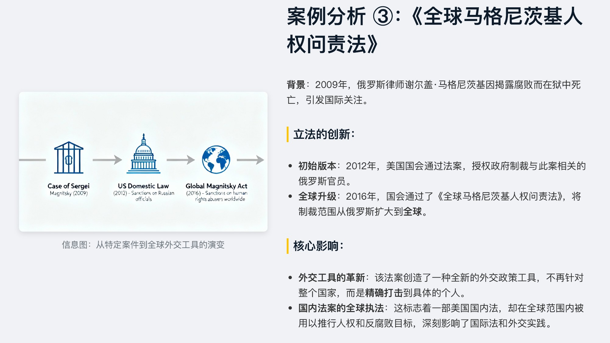

<div align="right">
  <details>
    <summary >🌐 Language</summary>
    <div>
      <div align="center">
        <a href="https://openaitx.github.io/view.html?user=icip-cas&project=PPTAgent&lang=en">English</a>
        | <a href="https://openaitx.github.io/view.html?user=icip-cas&project=PPTAgent&lang=zh-CN">简体中文</a>
        | <a href="https://openaitx.github.io/view.html?user=icip-cas&project=PPTAgent&lang=zh-TW">繁體中文</a>
        | <a href="https://openaitx.github.io/view.html?user=icip-cas&project=PPTAgent&lang=ja">日本語</a>
        | <a href="https://openaitx.github.io/view.html?user=icip-cas&project=PPTAgent&lang=ko">한국어</a>
        | <a href="https://openaitx.github.io/view.html?user=icip-cas&project=PPTAgent&lang=hi">हिन्दी</a>
        | <a href="https://openaitx.github.io/view.html?user=icip-cas&project=PPTAgent&lang=th">ไทย</a>
        | <a href="https://openaitx.github.io/view.html?user=icip-cas&project=PPTAgent&lang=fr">Français</a>
        | <a href="https://openaitx.github.io/view.html?user=icip-cas&project=PPTAgent&lang=de">Deutsch</a>
        | <a href="https://openaitx.github.io/view.html?user=icip-cas&project=PPTAgent&lang=es">Español</a>
        | <a href="https://openaitx.github.io/view.html?user=icip-cas&project=PPTAgent&lang=it">Italiano</a>
        | <a href="https://openaitx.github.io/view.html?user=icip-cas&project=PPTAgent&lang=ru">Русский</a>
        | <a href="https://openaitx.github.io/view.html?user=icip-cas&project=PPTAgent&lang=pt">Português</a>
        | <a href="https://openaitx.github.io/view.html?user=icip-cas&project=PPTAgent&lang=nl">Nederlands</a>
        | <a href="https://openaitx.github.io/view.html?user=icip-cas&project=PPTAgent&lang=pl">Polski</a>
        | <a href="https://openaitx.github.io/view.html?user=icip-cas&project=PPTAgent&lang=ar">العربية</a>
        | <a href="https://openaitx.github.io/view.html?user=icip-cas&project=PPTAgent&lang=fa">فارسی</a>
        | <a href="https://openaitx.github.io/view.html?user=icip-cas&project=PPTAgent&lang=tr">Türkçe</a>
        | <a href="https://openaitx.github.io/view.html?user=icip-cas&project=PPTAgent&lang=vi">Tiếng Việt</a>
        | <a href="https://openaitx.github.io/view.html?user=icip-cas&project=PPTAgent&lang=id">Bahasa Indonesia</a>
        | <a href="https://openaitx.github.io/view.html?user=icip-cas&project=PPTAgent&lang=as">অসমীয়া</a>
      </div>
    </div>
  </details>
</div>

<div align="center">
  
</div>

<table>
  <tr>
    <td width="50%">
      <video controls width="100%" src="https://github.com/user-attachments/assets/314bed6a-185e-4c81-9de5-35728e83e22a">
      </video>
    </td>
    <td width="50%">
      <video controls width="100%" src="https://github.com/user-attachments/assets/96eee616-5f79-4ea1-bd7f-bcaa466eda9e">
      </video>
    </td>
  </tr>
</table>

We **strongly recommend** deploying our fine-tuned model for the best experience with our agent project. According to our experiments, it **significantly outperforms existing open-source models**.

| Format | HuggingFace | ModelScope |
|--------|-------------|------------|
| GGUF (Quantized) | [Forceless/DeepPresenter-9B-GGUF](https://huggingface.co/Forceless/DeepPresenter-9B-GGUF) | [forceless/DeepPresenter-9B-GGUF](https://modelscope.cn/models/forceless/DeepPresenter-9B-GGUF) |
| Full Weights | [Forceless/DeepPresenter-9B](https://huggingface.co/Forceless/DeepPresenter-9B) | [forceless/DeepPresenter-9B](https://modelscope.cn/models/forceless/DeepPresenter-9B) |

## 📅 News

- **[2026/04]** 🎉 [DeepPresenter](https://arxiv.org/abs/2602.22839) accepted to **ACL 2026**!
- **[2026/03]** 🤗 We released fine-tuned models and taskset on [Hugging Face](https://huggingface.co/collections/ICIP/deeppresenter).
- **[2026/01]** 🆕 Freeform & template generation now support PPTX export and offline mode. Context management added to prevent context overflow.
- **[2025/12]** 🔥 Released **DeepPresenter** codebase with major upgrades — Deep Research Integration, Free-Form Visual Design, Autonomous Asset Creation, Text-to-Image Generation, and an Agent Environment with sandbox & 20+ tools.
- **[2025/09]** 🛠️ MCP server support added — see [MCP Server](PPTAgent/DOC.md#mcp-server-) for configuration details.
- **[2025/08]** 🎉 [PPTAgent](https://arxiv.org/abs/2501.03936) accepted to **EMNLP 2025**!
- **[2025/05]** ⭐ Reached **1,000 stars** on GitHub!
- **[2025/01]** 🔓 Open-sourced the PPTAgent codebase.

## Usage 📖

> [!IMPORTANT]
> Windows is not supported. If you are on Windows, please use WSL.
>
> We strongly recommend starting with the CLI and minimum task to confirm dependencies and environment is configured correctly.

### Configuration

If you use the CLI, `pptagent onboard` can help create and update these configurations interactively. If you use Docker Compose or build from source, you should prepare them manually:

```bash
cp deeppresenter/config.yaml.example deeppresenter/config.yaml
cp deeppresenter/mcp.json.example deeppresenter/mcp.json
```

#### Optional Services That Improve Quality

The following services can noticeably improve generation quality, especially for research depth, PDF parsing, and visual asset creation:

- **Tavily**: improves web search quality. Apply for an API key at [tavily.com](https://www.tavily.com/), then set `TAVILY_API_KEY` in [`deeppresenter/mcp.json`](deeppresenter/mcp.json).
- **MinerU**: improves PDF parsing quality. You can either apply for an API key at [mineru.net](https://mineru.net/apiManage/docs) and set `MINERU_API_KEY` in [`deeppresenter/mcp.json`](deeppresenter/mcp.json), or deploy MinerU locally and set `MINERU_API_URL` instead.
- **Text-to-image model**: improves image generation quality. Configure `t2i_model` in [`deeppresenter/config.yaml`](deeppresenter/config.yaml).


If you want a fully offline setup, deploy MinerU locally and set `offline_mode: true` in `deeppresenter/config.yaml` to avoid loading network-dependent tools such as web search.

More configurable variables can be found in [constants.py](deeppresenter/utils/constants.py).

### 1. Personal Use / OpenClaw Integration: CLI

> [!NOTE]
> On macOS, the CLI may automatically install several local dependencies, including Homebrew, Node.js, Docker, poppler, Playwright, and llama.cpp.
>
> On Linux, you should prepare the environment by yourself.

Use this mode if you want the fastest local setup or want to plug DeepPresenter into OpenClaw through the CLI.

```bash
# Install uv
curl -LsSf https://astral.sh/uv/install.sh | sh

# First-time interactive setup
uvx pptagent onboard

# Generate a presentation
uvx pptagent generate "Single Page with Title: Hello World" -o hello.pptx

# Generate with attachments
uvx pptagent generate "Q4 Report" \
  -f data.xlsx \
  -f charts.pdf \
  -p "10-12" \
  -o report.pptx
```

| Command             | Description                                       |
| ------------------- | ------------------------------------------------- |
| `pptagent onboard`  | Interactive configuration wizard                  |
| `pptagent generate` | Generate presentations                            |
| `pptagent config`   | View current configuration                        |
| `pptagent reset`    | Reset configuration                               |
| `pptagent serve`    | Start the local inference service used by the CLI |

### Docker Images

DeepPresenter publishes two runtime images:

| Local image name | Purpose | Docker Hub | 1ms.run mirror |
| --- | --- | --- | --- |
| `deeppresenter-host` | Host service for the web UI and orchestration runtime | [`forceless/deeppresenter-host`](https://hub.docker.com/r/forceless/deeppresenter-host) | [`docker.1ms.run/forceless/deeppresenter-host`](https://1ms.run/r/forceless/deeppresenter-host) |
| `deeppresenter-sandbox` | Sandbox image used by the runtime for isolated tool execution | [`forceless/deeppresenter-sandbox`](https://hub.docker.com/r/forceless/deeppresenter-sandbox) | [`docker.1ms.run/forceless/deeppresenter-sandbox`](https://1ms.run/r/forceless/deeppresenter-sandbox) |

### 2. Minimal Setup / Development: Build From Source

Use this mode if you want the smallest abstraction layer and full control over dependencies during development.

```bash
uv pip install -e .
playwright install-deps
playwright install chromium
npm install --prefix deeppresenter/html2pptx
modelscope download forceless/fasttext-language-id

docker pull forceless/deeppresenter-sandbox
docker pull forceless/deeppresenter-host
docker tag forceless/deeppresenter-sandbox deeppresenter-sandbox
docker tag forceless/deeppresenter-host deeppresenter-host

# or pull through the 1ms.run mirror
docker pull docker.1ms.run/forceless/deeppresenter-sandbox
docker pull docker.1ms.run/forceless/deeppresenter-host
docker tag docker.1ms.run/forceless/deeppresenter-sandbox deeppresenter-sandbox
docker tag docker.1ms.run/forceless/deeppresenter-host deeppresenter-host

# or build from dockerfile
docker build -t deeppresenter-sandbox -f deeppresenter/docker/SandBox.Dockerfile .
docker build -t deeppresenter-host -f deeppresenter/docker/Host.Dockerfile .
```

Start the app:

```bash
python webui.py
```

### 3. Server Deployment: Docker Compose

Use this mode for a stable server environment with explicit dependencies.

```bash
# Pull the public images to avoid build from source
docker pull forceless/deeppresenter-sandbox
docker pull forceless/deeppresenter-host
docker tag forceless/deeppresenter-sandbox deeppresenter-sandbox
docker tag forceless/deeppresenter-host deeppresenter-host

# Or pull through the 1ms.run mirror
docker pull docker.1ms.run/forceless/deeppresenter-sandbox
docker pull docker.1ms.run/forceless/deeppresenter-host
docker tag docker.1ms.run/forceless/deeppresenter-sandbox deeppresenter-sandbox
docker tag docker.1ms.run/forceless/deeppresenter-host deeppresenter-host

# Or build from source
docker build -t deeppresenter-sandbox -f deeppresenter/docker/SandBox.Dockerfile .
docker build -t deeppresenter-host -f deeppresenter/docker/Host.Dockerfile .

# Start the host service
docker compose up -d
```

The service exposes the web UI on `http://localhost:7861`.

## Case Study 💡

- #### Prompt: Please present the given document to me.

<div style="display: flex; flex-wrap: wrap; gap: 10px;">

  

  

  

  

  

  

  

  

  

  

</div>

- #### Prompt: 请介绍小米 SU7 的外观和价格

<div style="display: flex; flex-wrap: wrap; gap: 10px;">

  

  

  

  

  

  

</div>

- #### Prompt: 请制作一份高中课堂展示课件，主题为“解码立法过程：理解其对国际关系的影响”

<div style="display: flex; flex-wrap: wrap; gap: 10px;">

  

  

  

  

  

  

  

  

  

  

  

  

  

  

  

</div>

---

## Contributors 🌟

<table>
<tr>
    <td align="center" style="word-wrap: break-word; width: 120.0; height: 120.0">
        <a href=https://github.com/Force1ess>
            
            <br />
            <sub style="font-size:14px"><b>Force1ess</b></sub>
        </a>
    </td>
    <td align="center" style="word-wrap: break-word; width: 120.0; height: 120.0">
        <a href=https://github.com/Puellaquae>
            
            <br />
            <sub style="font-size:14px"><b>Puelloc</b></sub>
        </a>
    </td>
    <td align="center" style="word-wrap: break-word; width: 120.0; height: 120.0">
        <a href=https://github.com/hysyyds>
            
            <br />
            <sub style="font-size:14px"><b>hongyan</b></sub>
        </a>
    </td>
    <td align="center" style="word-wrap: break-word; width: 120.0; height: 120.0">
        <a href=https://github.com/imHuZijian>
            
            <br />
            <sub style="font-size:14px"><b>BrandonHu</b></sub>
        </a>
    </td>
    <td align="center" style="word-wrap: break-word; width: 120.0; height: 120.0">
        <a href=https://github.com/Dnoob>
            
            <br />
            <sub style="font-size:14px"><b>Dnoob</b></sub>
        </a>
    </td>
</tr>
<tr>
    <td align="center" style="word-wrap: break-word; width: 120.0; height: 120.0">
        <a href=https://github.com/Sadahlu>
            
            <br />
            <sub style="font-size:14px"><b>Sadahlu</b></sub>
        </a>
    </td>
    <td align="center" style="word-wrap: break-word; width: 120.0; height: 120.0">
        <a href=https://github.com/lnennnn>
            
            <br />
            <sub style="font-size:14px"><b>lnennnn</b></sub>
        </a>
    </td>
    <td align="center" style="word-wrap: break-word; width: 120.0; height: 120.0">
        <a href=https://github.com/KurisuMakiseSame>
            
            <br />
            <sub style="font-size:14px"><b>KurisuMakiseSame</b></sub>
        </a>
    </td>
    <td align="center" style="word-wrap: break-word; width: 120.0; height: 120.0">
        <a href=https://github.com/RheagalFire>
            
            <br />
            <sub style="font-size:14px"><b>Aarish Alam</b></sub>
        </a>
    </td>
    <td align="center" style="word-wrap: break-word; width: 120.0; height: 120.0">
        <a href=https://github.com/Angelenx>
            
            <br />
            <sub style="font-size:14px"><b>Angelen</b></sub>
        </a>
    </td>
</tr>
<tr>
    <td align="center" style="word-wrap: break-word; width: 120.0; height: 120.0">
        <a href=https://github.com/kylooh>
            
            <br />
            <sub style="font-size:14px"><b>Eliot White</b></sub>
        </a>
    </td>
    <td align="center" style="word-wrap: break-word; width: 120.0; height: 120.0">
        <a href=https://github.com/EvolvedGhost>
            
            <br />
            <sub style="font-size:14px"><b>EvolvedGhost</b></sub>
        </a>
    </td>
    <td align="center" style="word-wrap: break-word; width: 120.0; height: 120.0">
        <a href=https://github.com/ISCAS-zwl>
            
            <br />
            <sub style="font-size:14px"><b>ISCAS-zwl</b></sub>
        </a>
    </td>
    <td align="center" style="word-wrap: break-word; width: 120.0; height: 120.0">
        <a href=https://github.com/James4Ever0>
            
            <br />
            <sub style="font-size:14px"><b>白雨 | James Brown</b></sub>
        </a>
    </td>
    <td align="center" style="word-wrap: break-word; width: 120.0; height: 120.0">
        <a href=https://github.com/LasRuinasCirculares>
            
            <br />
            <sub style="font-size:14px"><b>JunZhang</b></sub>
        </a>
    </td>
</tr>
<tr>
    <td align="center" style="word-wrap: break-word; width: 120.0; height: 120.0">
        <a href=https://github.com/openaitx-system>
            
            <br />
            <sub style="font-size:14px"><b>Open AI Tx</b></sub>
        </a>
    </td>
    <td align="center" style="word-wrap: break-word; width: 120.0; height: 120.0">
        <a href=https://github.com/haosenwang1018>
            
            <br />
            <sub style="font-size:14px"><b>Sense_wang</b></sub>
        </a>
    </td>
    <td align="center" style="word-wrap: break-word; width: 120.0; height: 120.0">
        <a href=https://github.com/DeJeune>
            
            <br />
            <sub style="font-size:14px"><b>SuYao</b></sub>
        </a>
    </td>
    <td align="center" style="word-wrap: break-word; width: 120.0; height: 120.0">
        <a href=https://github.com/JiwaniZakir>
            
            <br />
            <sub style="font-size:14px"><b>Zakir Jiwani</b></sub>
        </a>
    </td>
    <td align="center" style="word-wrap: break-word; width: 120.0; height: 120.0">
        <a href=https://github.com/Dormiveglia-elf>
            
            <br />
            <sub style="font-size:14px"><b>Zhenyu</b></sub>
        </a>
    </td>
</tr>
</table>

[](https://star-history.com/#icip-cas/PPTAgent&Date)

## Citation 🙏

If you find this project helpful, please use the following to cite it:
```bibtex
@inproceedings{zheng-etal-2025-pptagent,
    title = "{PPTA}gent: Generating and Evaluating Presentations Beyond Text-to-Slides",
    author = "Zheng, Hao  and
      Guan, Xinyan  and
      Kong, Hao  and
      Zhang, Wenkai  and
      Zheng, Jia  and
      Zhou, Weixiang  and
      Lin, Hongyu  and
      Lu, Yaojie  and
      Han, Xianpei  and
      Sun, Le",
    editor = "Christodoulopoulos, Christos  and
      Chakraborty, Tanmoy  and
      Rose, Carolyn  and
      Peng, Violet",
    booktitle = "Proceedings of the 2025 Conference on Empirical Methods in Natural Language Processing",
    month = nov,
    year = "2025",
    address = "Suzhou, China",
    publisher = "Association for Computational Linguistics",
    url = "https://aclanthology.org/2025.emnlp-main.728/",
    doi = "10.18653/v1/2025.emnlp-main.728",
    pages = "14413--14429",
    ISBN = "979-8-89176-332-6",
    abstract = "Automatically generating presentations from documents is a challenging task that requires accommodating content quality, visual appeal, and structural coherence. Existing methods primarily focus on improving and evaluating the content quality in isolation, overlooking visual appeal and structural coherence, which limits their practical applicability. To address these limitations, we propose PPTAgent, which comprehensively improves presentation generation through a two-stage, edit-based approach inspired by human workflows. PPTAgent first analyzes reference presentations to extract slide-level functional types and content schemas, then drafts an outline and iteratively generates editing actions based on selected reference slides to create new slides. To comprehensively evaluate the quality of generated presentations, we further introduce PPTEval, an evaluation framework that assesses presentations across three dimensions: Content, Design, and Coherence. Results demonstrate that PPTAgent significantly outperforms existing automatic presentation generation methods across all three dimensions."
}

@misc{zheng2026deeppresenterenvironmentgroundedreflectionagentic,
      title={DeepPresenter: Environment-Grounded Reflection for Agentic Presentation Generation},
      author={Hao Zheng and Guozhao Mo and Xinru Yan and Qianhao Yuan and Wenkai Zhang and Xuanang Chen and Yaojie Lu and Hongyu Lin and Xianpei Han and Le Sun},
      year={2026},
      eprint={2602.22839},
      archivePrefix={arXiv},
      primaryClass={cs.AI},
      url={https://arxiv.org/abs/2602.22839},
}
```
